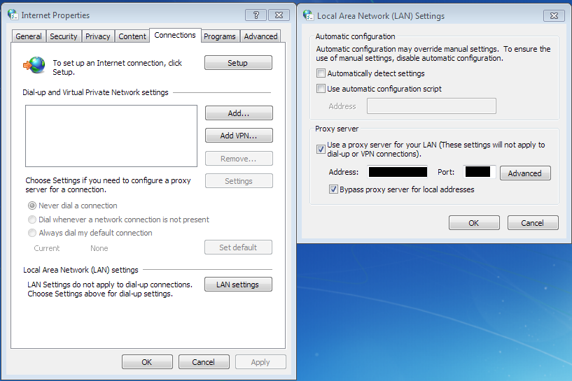

<!-- README.md is generated from README.Rmd. Please edit that file -->
[](https://travis-ci.org/) [](https://codecov.io/gh/PublicHealthEngland/hcaidcs)

This is a collection of functions to make working with data from the [HCAI DCS](https://hcaidcs.phe.org.uk/) easier.

Installation
------------

The quickest way to install the package is to use `install_git` from the devtools package.

``` r
# install devtools if necessary
install.packages("devtools")

# then install the hcaidcs package
devtools::install_git('https://github.com/publichealthengland/hcaidcs.git')
```

### Github installation problems

The above command may return the following error:

    Installation failed: Error in 'git2r_clone': failed to send request: A connection with the server could not be established

This is likely to happen if you are installing it in a work environment, where local IT have set up a proxy server to connect to the internet. You may be able to get around this by telling R to use your proxy settings.

To determine your proxy settings go to 'Internet options' and select the 'Connections' tab. Choose the 'LAN settings' button and make a note of the address and port number. 

then, in R do the following:

``` r
install.packages("httr")# only if you don't already have it installed
library(httr)
set_config(
  use_proxy(url="ddd.ddd.ddd.dd", port=dddd, username="windowsuser.name", 
            password="windows_pwdtext")
)
devtools::install_git('https://github.com/publichealthengland/hcaidcs.git')
```

where `d` is a digit, url is the address you recorded above and port is the port, commonly 8080.

### Alternative installation

If you are unable to identify your local proxy settings, one can download the zip file from github and do the following:

1.  Save the zip file to a local drive (normally `C:`, but often `H:` if you are at PHE)\` but do not unzip
2.  Open RStudio
3.  Run the following line: `install.packages(file.choose(), repos=NULL)`
4.  This will launch a file chooser where you can select the zip file you have just downloaded.

This should install the package to the R package library.

If installation is successful you will then be able to load the package with `library(hcaidcs)`

Use
---

Please see [the online documentation](https://publichealthengland.github.io/hcaidcs/) for descriptions of functions. Vignettes on the use of the package will follow soon.

Functions that begin `aec_` are intended for producing tables or plots for the annual epidemiologic commentary.

Functions beginning `ann_tab_` are intended for the production of the annual tables.

Functions prefixed `kh03_` indicate functions for use in the preparation of the kh03 denominator data.

Functions prefixed `mf_` indicate functions for use in the preparation of the HCAI monthly factsheet for the department of health.

Copyright notice
----------------

This package was developed at Public Health England and carries the Open Government Licence as a result. However, it also includes geographic data from Office for National Statistics (ONS) and so the following copyright statement also applies. Contains National Statistics data © Crown copyright and database right 2018

Contains OS data © Crown copyright and database right 2018

Contributions
-------------

Contributions to this package are welcome. Please see the [Contribution guidelines](https://github.com/PublicHealthEngland/hcaidcs/blob/master/CONTRIBUTING.md). Please also see the [Code of Conduct](https://github.com/PublicHealthEngland/hcaidcs/blob/master/CODE_OF_CONDUCT.md)
